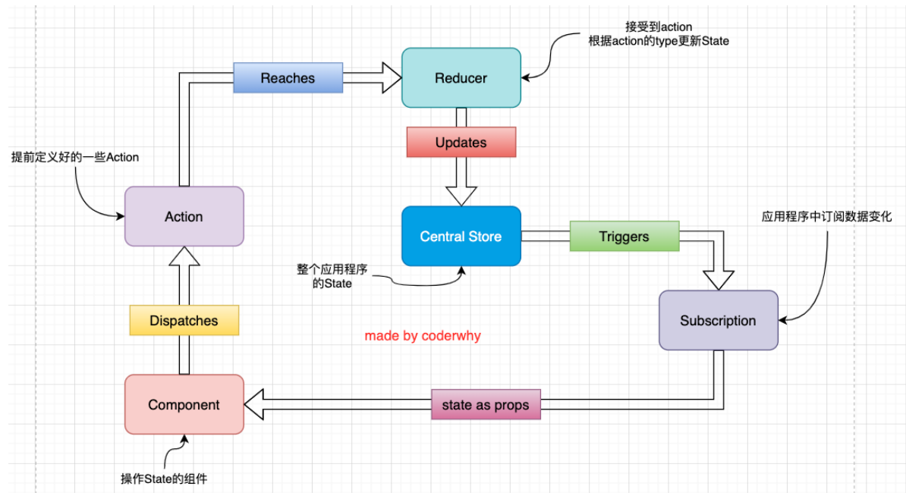
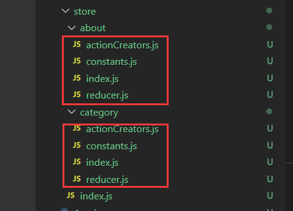

# Redux
Rudux是一个帮助我们管理State的容器；是JavaScript的状态容器，提供了可预测的状态管理。且Redux也可以和其他界面库一起用(vue,angula),且体积很小，2kb左右
## 理解JavaScript纯函数
* 相同的输入得到相同的输出
* 函数执行过程中，不能产生副作用

## Redux的核心理念

### Store-存储数据
store用来存储state。
### action-更新数据
所有数据的变化，都必须通过派发(dispatch)action来更新。action是一个普通的js对象，用来描述这次更新的type和content。
### reducer-将state和action联系在一起
reducer是一个纯函数；将传入的state和action结合起来生成一个新的state。

## Redux三大原则
### 单一数据源
* 整个应用程序的state被存储在一颗object tree中，并且这个object tree只存储在一个store中。
* redux没有强制不让我们创建多个store，但是那样不利于数据的维护。
* 单一的数据源可以让整个应用程序的state变得方便维护，追踪，修改。

### state是只读的
* 唯一修改state的方法一定是触发action，不要试图通过其他任何方式来修改state
* 确保了View或者网络请求都不能直接修改state，他们只能通过action来描述自己想要如何修改state。
* 保证了所有的修改都被集中化处理，并且按照严格的顺序来执行。

### 使用纯函数来执行修改
* 通过reducer将旧state和actions联系在一起，返回一个新的state
* 随着应用程序的复杂度增加，我们可以将reducer拆分成多个，分别操作state tree的一部分。
* 所有的reducer函数都应该是纯函数。

## Redux结构划分
如果将所有的逻辑代码写到一起，redux变得复杂时代码就难以维护。
### store/index.js
state存储，挂载reducer

### store/reducer.js
抽离出state初始值和reducer函数到一个独立文件中，防止reducer过于复杂，导致index代码杂乱。

### store/actionCreators.js
控制action的生成，并且将自动生成函数抽离到单独的文件中。

### store/constants.js
actionCreators和reducer函数中使用字符串常量是一致的，所以将常量抽取到一个独立的文件中。

## Redux使用过程


## React中使用Redux
### 安装redux
```
$ npm install redux
```
### 创建store文件夹，在reducer中初始化数据
```js
/*reducer.js*/
import {ADD_NUM} from './constants.js'
const initalState = {
    counter:0
}

function reducer(state=initalState,action){
    switch(action.type){
        case ADD_NUM:
            return {...state,counter:state.counter+action.num}
        default:
            return state;
    }
}

export default reducer;


/*index.js*/
import {reducer} from './reducer'
import {createStore} from 'redux'

const store = createStore(reducer);

export default store;

/*App.jsx*/
import store from './store/index'
import {actionCreators} from './store/actionCreators.js'

constructor(){
    super()
    this.state = {
        //初始化数据
        counter: store.getState().counter
    }
}

componentDidMount(){
    //对数据做订阅
    store.subscribe(()=>{
        const state = store.getState()
        this.setState({
            counter:state.counter
        })
    })
}
addnum(num){
    //激发action，请求修改数据
    store.dispatch(actionCreators(num))
}
render(){
    const {counter} = this.state
    return(
        <div>
            <h2>counter:{counter}</h2>
            <div>
                <button onClick={e=>this.addnum(1)}>+1</button>
                <button onClick={e=>this.addnum(-1)}>-1</button>
            </div>
        </div>
    )
}

/*actionCreators.js*/
import {ADD_NUM} from './constants.js'
export const addNumberAction = (num) =>({
    type:ADD_NUM,
    num
})

/*constants.js*/
export const ADD_NUM = "add_num"


```

## Redux中的connect(将上述过程进行了封装)
connect()返回值是一个高阶组件。
### 使用步骤
#### 安装react-redux
```
npm install react-redux
```
#### 引入Provider和store
将store通过Provider提供给根组件
```jsx
import React from 'react';
import ReactDOM from 'react-dom/client';
import {Provider} from 'react-redux'
import App from './App';
import store from './store';

const root = ReactDOM.createRoot(document.getElementById('root'));
root.render(
  <React.StrictMode>
    <Provider store={store}>
      <App/>
    </Provider>
  </React.StrictMode>
);

```
#### 在对应页面中映射store的内容，更新时只更新那一部分
使用connect映射store中的数据并渲染到页面上，connect是一个返回值为高阶组件的函数。
```jsx
/*About.jsx*/
import React, { PureComponent } from 'react'
import {connect} from 'react-redux'
import { addNumberAction } from '../store/actionCreators'

export class About extends PureComponent {
  addNumber(num){
    this.props.addNumber(num)
  }
  render() {
    const {counter} = this.props
    return (
      <div>
        <h2>About Page:{counter}</h2>
        <button onClick={e=>this.addNumber(88)}>
        +88
        </button>
      </div>
    )
  }
}
/**
 * 定义一个映射函数
 * 以props的形式将store中的数据"连接"到这个组件
 * 
*/
const mapStateToProps = (state)=>({
    counter:state.counter
})

/** 
 *将store的dispatch映射到组件中 
*/
const mapDispatchToProps = (dispatch)=>({
    addNumber(num){
        dispatch(addNumberAction(num))
    }
})

/** 
 * 返回被高阶组件包裹操作过的About
 * connect(fn1,fn2)的返回值是一个高阶组件
*/
export default connect(mapStateToProps,mapDispatchToProps)(About)
```

## Redux异步请求数据并存储到state中
以前是在生命周期中请求数据，将数据dispatch到store中.dispatch通常只能派发对象，但要达到异步请求的效果，需要dispatch派发一个回调函数。

### 安装store增强库—— redux-thunk
```
npm install react-thunk
```
### 对store增强
```js
/*./store/index.js*/
import reducer from './reducer'
import {createStore,applyMiddleware} from 'redux'
import thunk from 'redux-thunk'

//对store进行增强
const store = createStore(reducer,applyMiddleware(thunk));

export default store;
```
### 在actionCreators.js中设置
如果是一个普通的action，那么我们需要返回action对象，但对象是不能直接拿到从服务器中请求的异步数据的，因此我们需要返回一个函数，在函数中进行异步请求，将数据存入store。
```jsx
export const fetchHomeMultidataAction = () => {
    //返回一个函数 
    return (dispatch,getState)=>{
        //异步操作：网络请求
        axios.get(url).then(res=>{
            const banners = res.data.data.banner.list
            const recommends = res.data.data.recommend.list
            dispatch(changeBannersAction(banners))
            dispatch(changeRecommendsAction(recommends))
        })
    }
}
```
### 在组件中通过connect和mapDispatchToProps进行调用
当dispatch(fetchHomeMultidataAction())被执行时，函数fetchHomeMultidataAction就会被执行，数据就会被存储进store达到异步请求的效果，也避免了将请求代码写在组件中。
```jsx
import React, { PureComponent } from 'react'
import {connect} from 'react-redux'
import {fetchHomeMultidataAction } from '../store/actionCreators'

export class Category extends PureComponent {
  componentDidMount(){
    this.props.fetchHomeMultidata()
  }
  render() {
    return (
      <div>Category Page</div>
    )
  }
}

const mapDispatchToProps = (dispatch)=>({
    fetchHomeMultidata(){
        dispatch(fetchHomeMultidataAction())
    }
})

export default connect(null,mapDispatchToProps)(Category)
```

## 将Redux的代码分模块管理
每个组件对应一个模块


```jsx
/*./store/index.js*/
import {createStore,applyMiddleware,compose,combineReducers} from 'redux'
import thunk from 'redux-thunk'
import categoryReducer from './category/reducer'
import aboutReducer from './about/reducer'

//将两个reducer合并在一起
const reducer = combineReducers({
    category:categoryReducer,
    about:aboutReducer
})

//trace:跟踪调用代码的位置
const composeEnhancers = window.__REDUX_DEVTOOLS_EXTENSION_COMPOSE__({trace:true}) || compose
const store = createStore(reducer,composeEnhancers(applyMiddleware(thunk)));

export default store;

```
### 外部调用state中的数据
因为我们对组件的数据进行了模块化管理，且最终的reducer是依赖于几个模块的reducer组合而来，每个模块的数据都化作对象组合在最终的数据中。因此取对应模块的数据时需要加上模块名。
```jsx
/*以mapStateToProps示例*/
const mapStateToProps = (state)=>({
    counter:state.about.counter,
    banners:state.category.banners,
    recommends:state.category.recommends
})
```

## Redux的调试工具 —— Redux-devtool
默认在开发环境中打开，生产环境中关闭。第一次安装默认关闭，需要手动打开。
```js
import reducer from './reducer'
import {createStore,applyMiddleware,compose} from 'redux'
import thunk from 'redux-thunk'

//trace:跟踪调用代码的位置
const composeEnhancers = window.__REDUX_DEVTOOLS_EXTENSION_COMPOSE__({trace:true}) || compose


const store = createStore(reducer,composeEnhancers(applyMiddleware(thunk)));

export default store;
```
## dispatch派发拦截

### 拦截普通action
派发前后进行数据拦截，打印日志
```js
/*store/index.js*/

//对每次派发的action进行拦截，打印日志

function log(store){
    //dispatch本质上需要原store的dispatch函数，防止递归，先存起来
    let next = store.dispatch
    function logAndDispatch(action){
        console.log("当前派发的action:",action)
        next(action)
        console.log("派发之后的结果：",store.getState())
    }
    //monkey patch:猴补丁 => 篡改现有的代码，对整体的逻辑进行修改。
    store.dispatch = logAndDispatch
}

log(store)
```
### thunk增强件的原理
```js
/*thunk.js*/
export default function thunk(store){
    const next = store.dispatch
    function dispatchThunk(action){
        if(typeof action === 'function'){
            action(store.dispatch,store.getState)
        }else{
            next(action)
        }
    }
    store.dispatch = dispatchThunk
}
```
