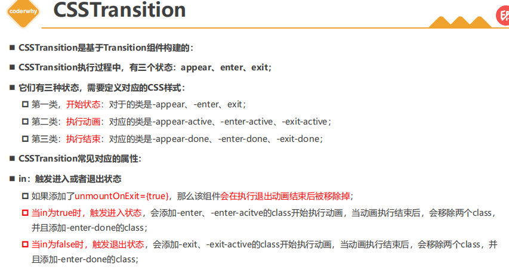
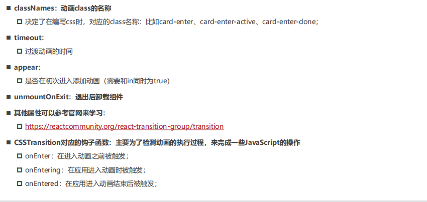
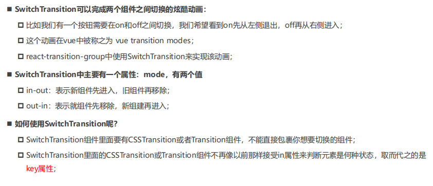

# React动画
在开发中，我们想要给一个组件的显示和消失添加某种过渡动画，可以很好的增加用户体验。React社区为我们提供了react-transition-group用来完成过渡动画。
* 这个库可以帮助我们方便的实现组件的**入场**和**离场**动画
    ````
    #npm
    npm install react-transition-group --save

    #yarn
    yarn add react-transition-group
    ````
## react-transition-group
主要包含四个组件

### Transition
* 该组件和平台无关（不一定要结合css）
* 在前端开发中，我们一般是结合css来完成样式，所以比较常用的是CSSTransition
### CSSTransition
**官方网站： https://reactcommunity.org/react-transition-group/transition**
在前端开发中，通常使用CSSTransition来完成过渡动画效果。本质上是对包裹住的元素添加和移除类，然后通过添加的类名对样式进行改变。

常见属性


### SwitchTransition
两个组件显示和隐藏切换时，使用该组件

### TransitionGroup
将多个动画组件包裹在其中，一般用于列表中元素的动画
**包裹中的CSSTransition的key必须是唯一的**
## React的过渡动画

## CSSTransition使用

## 常见的属性设置

## SwitchTransition

## TransitionGroup