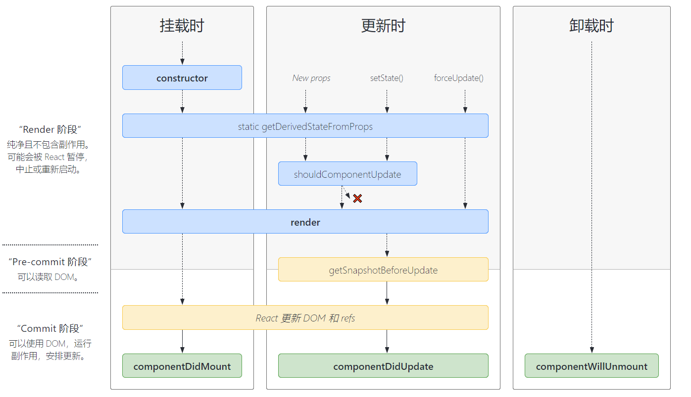
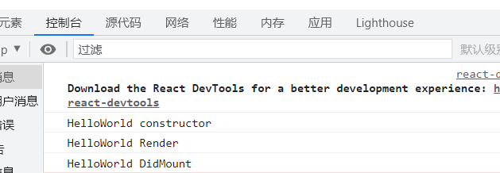
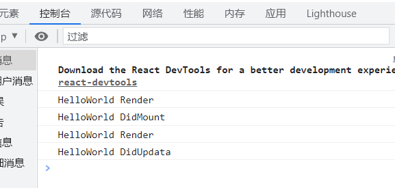
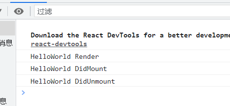
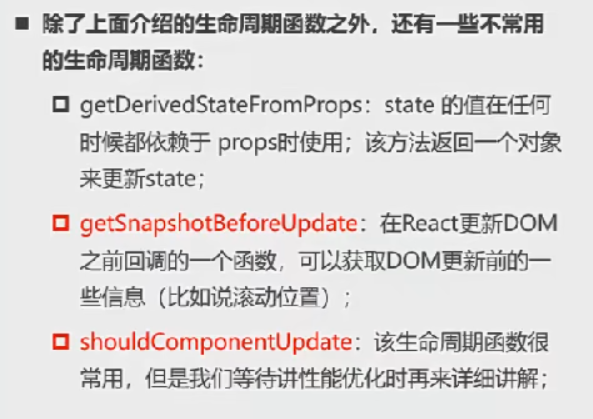
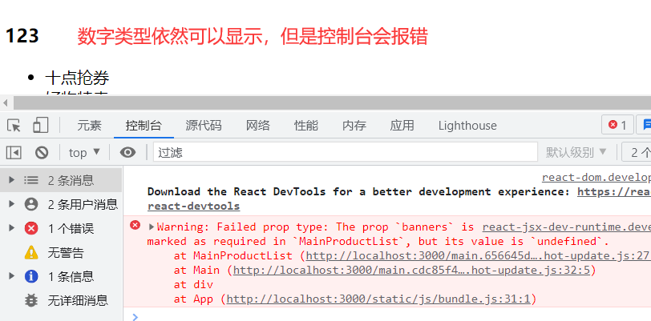

# React组件化
组件化是react的核心思想，组件化提供了一种抽象，让我们可以开发出一个个**独立可复用**的小组件来构造我们的应用。任何的应用都会被抽象成一颗组件树。
## 组件的种类

### 按照定义方式分类
* 类组件(Class Conponent)
* 函数组件(Function Component)

### 根据组件内部是否有状态需要维护
* 无状态组件(Stateless Component)
* 有状态组件(Stateful Component)

### 根据组件的不同职责
* 展示型组件(Presentational Component)
* 容器型组件(Container Component)

### render函数的返回类型
当render被调用时，会检查this.props和this.state的变化并返回以下类型之一：
1. React元素
   * 通常通过JSX创建。
   * 例如，<div>和<MyComponent />会被分别渲染成DOM节点和自定义组件。
2. 返回一个数组/Fragments(后面补)
   *  使得render方法可以返回多个元素
   *  返回数组的话，会被React遍历并拼接在一起。
3. Portals
   * 可以渲染子节点到不同的DOM子树中(后面详细补)
   
## 类组件
* 组件名称大写字符开头
* 类组件需要继承自React.Component
* 类组件必须实现render函数
* consturctor是可选的
* this.state中维护的就是我们组件内部的数据
* render()方法是class组件中**唯一必须实现的方法**

```jsx
import React from 'react';

import HelloWorld from './Components/HelloWorld';
//类组件
class App extends React.Component{
    constructor(){
      super()
      this.state={
        message:'I Am a ReactApp'
      }
    }
    render(){
      const {message} = this.state
      return(
        <div>
          <h2>{message}</h2>
          <HelloWorld />
        </div>
      )
    }
  }

export default App 
```

### 类组件的生命周期
生命周期是一个抽象概念，在生命周期的整个过程，分为了很多个阶段。React为了告诉我们当前处于哪些阶段，会对我们组件内部实现的**某些函数进行回调**，这些函数就是生命周期函数。


1. 先执行constructor函数，再执行render函数
   1. constructor:给this.state赋值对象来初始化内部的state.
   2. 为事件绑定实例(this)
   3. componentDidMount会在组件挂载后(插入DOM树)立即调用。
   4. componentDidMount常见操作：依赖于DOM的操作，**发送网络请求**，添加订阅(在componentWillUnmount中取消订阅)
    ```jsx
    import React from 'react';

    class HelloWorld extends React.Component{
        //1.构造方法
        constructor(){
            super();
            this.state={
                message:"Hello World"
            }
            console.log("HelloWorld constructor")
        }
         //3.挂载
        componentDidMount(){
            console.log("HelloWorld DidMount")
        }

        //2.执行render
        render(){
            console.log("HelloWorld Render")
            const {message} = this.state
            return(
                <div>
                    <h2>{message}</h2>
                </div>
            )
        }
    }

    export default HelloWorld
    ```
    
2. 组件内容有更新，会重新render并且执行，componentDidUpdate函数
   1. componentDidUpdate会在更新后立即被调用，首次渲染不会执行该方法。
   2. 当组件更新时，可在此处对DOM进行操作，如果对更新前后的props比较了解，也可以进行网络请求(例如当props未发生变化时就不发送网络请求)
    ```jsx
    changeText(){
        this.setState({
            message:"Im Fine Thank You"
        })
    }
    //3.挂载
    componentDidMount(){
        console.log("HelloWorld DidMount")
    }

    //4.组件更新
    componentDidUpdate(){
        console.log("HelloWorld DidUpdata")
    }

    //2.执行render
    render(){
        console.log("HelloWorld Render")
        const {message} = this.state
        return(
            <div>
                <h2>{message}</h2>
                <button onClick={()=>this.changeText()}>ChangeText</button>
            </div>
        )
    }
    ```
    
3. 卸载组件
   1. componentWillUnmount会在组件卸载及销毁前直接调用
   2. 此方法中执行必要的清理操作，例如清除timer，取消网络请求或者清除订阅
   ```jsx
    {/*HelloWorld中*/}
    componentDidUnmount(){
        console.log("HelloWorld DidUnmount")
    }

    {/*App中*/}
    btnClick(){
        this.setState({
            isShowHW:!this.state.isShowHW
        })
    }
    render(){
        const {isShowHW} = this.state//默认为ture
        return(
            <div>
                {/*通过isShowHW的值来控制HW组件的销毁*/}
                {isShowHW && <HelloWorld />}
                <button onClick={()=>{this.btnClick()}}>切换HW组件存活状态</button>
            </div>
        )
    }
   ```
    
4. 其他不常用的生命周期函数
    

### 类组件的setSate
Vue中内部对响应式数据的更改进行劫持并调用render函数，而React把数据的管理交给你，当你进行setState的时候再调用render函数。
#### 为什么要使用setState?
* 因为React并不会对数据进行劫持，当我们修改state，希望React根据最新的State来成功新渲染界面，但是这种方式的修改React并不知道数据发生了变化。
* React没有实现类似于Vue2中的Object.defineProperty/Vue3中的Proxy方式来监听数据的变化。因此我们必须**通过setState来告知React数据已经发生了变化**

#### 为什么setState要设置成异步？
1. 显著提高性能
   1. 如果每次调用setState都进行一次更新，那么意味着render函数会被频繁调用，界面重新渲染，效率很低。
   2. 最好的办法是获取到多个更新，之后执行批量更新。
2. 如果同步更新了state，但是还没有执行render函数，那么render函数中返回的模板里的state数据和传递给子组件的props数据还是原来的没有更新的，不能保持同步，无法保证数据的一致性。

* 个人理解
  ```
  * 可以以宏任务微任务来理解，将render看作宏任务，setState看作微任务，微任务队列执行完毕再执行宏任务，多次的setState操作进入队列，执行完毕后再进行render渲染
  * 可以提高性能，如果同步进行的话，多次setState会造成多次的render函数执行，多次的diff算法新旧对比会导致多次的dom操作，导致页面进行多次的重绘或回流。 
  * 多次的setState会被React收集在一个执行队列中，最终只进行一次render函数的执行。
  ```

* React18之前，有一些情况**setState是同步的**
  * 18之前放在setTimeOut，promise，原生监听中的setState是一个同步操作，18之后全部会被放入处理队列中进行批处理，变成异步。


## 函数式组件
函数组件是使用function来进行定义的函数，只是这个函数会返回和类组件中render函数返回一样的内容。
### 函数组件的特点
1. 没有自己的生命周期，但是也会被更新并挂载
2. this关键字不能指向组件实例
3. 没有内部状态(state)


## 组件的嵌套
不能将一个应用程序的所有逻辑都放在一个组件中，因此要对程序进行组件化拆分，再将这些组件组合嵌套在一起，最终形成我们的应用程序。

## 组件之间的通信

### 父子组件通信
#### 父传子
父组件同过**属性 = 值**的形式来传递给子组件数据，子组件通过**props**参数获取父组件传递过来的数据。
  * 可以在子组件通过propTypes限制父组件传递值的类型
    ```jsx
        import propTypes from 'prop-types'
        //限制传入的props的类型
        MainProductList.propTypes = {
            //isRequired表示必须传入
            banners:propTypes.array.isRequired,
            title:propTypes.string
        }
        //可以给不要求必须传入的变量定义默认值
        MainProductList.defaultProps={
            title:'商品列表'
        } 
    ```
    

#### 子组件传递父组件
父组件向子组件传递一个函数，在子组件中进行函数的回调即可操作父组件数据。
```jsx
/*App*/
class App extends Component {
  constructor(){
      super()
      this.state = {
        counter:100
      };
      
  }

  changeCounter(count){
      this.setState({
          counter:this.state.counter+count
      })
  }
  render() {
    const {counter} = this.state
    return (
      <div> 
          <h2>当前计数：{counter}</h2>
          <AddCounter addClick={(count)=>{this.changeCounter(count)}}/>
      </div>
    );
  }
}

/*子组件*/
class AddCounter extends Component {
  addCounter(count){
    this.props.addClick(count)
  }
  render() {
    return (
      <div> 
          <button onClick={()=>this.addCounter(1)}>+1</button>
          <button onClick={()=>this.addCounter(5)}>+5</button>
          <button onClick={()=>this.addCounter(10)}>+10</button>
      </div>
    );
  }
}
```

### 非父子组件数据的共享——context
* Context提供了一种**在组件之间共享此类值的方式**，不必显示地通过组件树的逐层传递props
* Context设计目的是为了**共享那些对于一个组件树而言是"全局的"数据**，例如当前认证的用户，主题，或者首选语言。
  
创建步骤：
  1. 创建一个context
     ```jsx
       import React from 'react';
      //1.创建一个Context
      const ThemeContext = React.createContext()
      export default ThemeContext;
     ```
  2. 在根组件中引用
     ```jsx
      import ThemeContext from './context/theme-context'

        render() {
      const {info} = this.state
        return (
          <div>
              <h2>App</h2>
              {/* context使用第二步：通过ThemeContext中的value属性为后代提供数据,包裹在其中的组件都可以使用value中的数据 */}
              <ThemeContext.Provider value={{color:'red',size:'20'}}>
                <Home {...info} />
              </ThemeContext.Provider>
          </div>
        );
      }
      
     ```
  3. 在被包裹组件中mingque组件的contextType为某一个Context
     ```jsx
     //类组件
      import ThemeContext from './context/theme-context'
       
      //拿到值(区别于props)
        const {name,age} = this.props
        const {color,size} = this.context

      //指定Context
        Home.contextType = ThemeContext

      //函数式组件
      import ThemeContext from './context/theme-context'
      function HomeBanner(){
          return(
              
              <div>
                  {/* 函数式组件中使用context共享的数据 */}
                  {
                      <ThemeContext.Consumer>
                          {
                              value=>{
                              return <h2>color:{value.color}</h2>
                              }
                          }
                      </ThemeContext.Consumer>
                  }
              </div>
          )
      }
     ```


### 非父子组件通信——eventBus

## React中的插槽(slot)
在开发中，我们抽取了一个组件，但是为了让这个组件具备更强的通用性，我们不能将组件中的内同限制为固定的div，span等等这些元素，我们应当让使用者决定某一块区域应当存放什么内容——**slot**

### 组件的Children子元素
组件在根组件中使用双标签，children中包含开始标签到结束标签的所有内容。**放多个元素=>Children数组，单个元素=>Children即为该元素**，如果要限制类型为数组/单个元素，可以用defaultProps进行定义。
```jsx
/* 根组件*/
import NavBar from './nav-bar';

class App extends Component {
  render() {
    return (
      <div> 
          {/* 插槽方法一：双标签中加children */}
            <NavBar>
               <button>按钮</button> 
               <h2>I AM TITLE</h2>
               <i>斜体文字</i>
            </NavBar>    
      </div>
    );
  }
}

/*组件*/
class NavBar extends Component {
  render() {
    const {children} = this.props
    return (
      <div className='nav-bar'> 
        <div className="left">{children[0]}</div>
    <div className="center">{children[1]}</div>
    <div className="right">{children[2]}</div>
      </div>
    );
  }
}
```
**弊端**：1.children可能是元素，也可能是数组，使用时需要完全清楚传入的数据类型。2.页面展示需要你对数组中的索引对应的值是什么非常清楚，否则会错乱。

### props属性传递React元素（推荐）
直接通过props传递，然后渲染在子组件的页面上，简单粗暴
```jsx
/*App*/
import NavBarTow from './nav-bar2';

class App extends Component {
  render() {
    return (
      <div> 
            {/* 使用props实现插槽 */}
            <NavBarTow 
              leftSlot = {<button>按钮2</button>}
              centerSlot = {<h2>I AM TITLE2</h2>}
              rightSlot = {<i>斜体文字2</i>}
            />
      </div>
    );
  }
}

/*nav-bar2*/
class NavBarTow extends Component {
  render() {
      const {leftSlot,centerSlot,rightSlot} = this.props
    return (
      <div className="nav-bar">
          <div className="left">{leftSlot}</div>
          <div className="center">{centerSlot}</div>
          <div className="right">{rightSlot}</div>
      </div>
    );
  }
}
```
