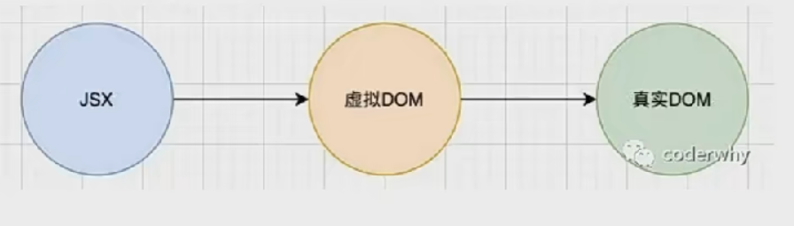
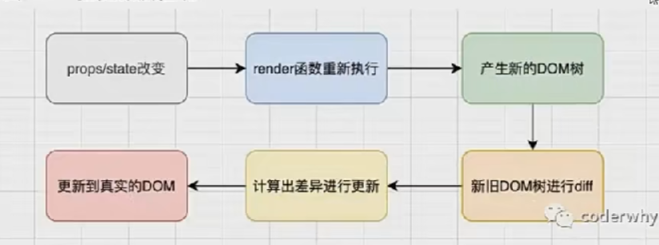

# React组件(二)
## React的渲染流程

## React的更新流程

React在props或state发生改变时，会调用React的render方法，会创建一颗不同的树，然后使用diff算法将这个树与真实dom作对比。

### React进行两树对比更新UI
* 如果一棵树参照另一棵树进行完全比较更新，那么即使是最先进的算法，时间复杂度也是O(n²)，n是树中元素的数量。
于是，React对这个算法进行了优化，时间复杂度变为O(n)
    1. 只进行同层节点的相互比较，不会跨节点比较
    2. 不同类型的节点，产生不同的树结构
    3. 开发中，可以通过key来指定哪些节点在不同的渲染下保持稳定。
#### key的注意事项
1. key是唯一的
2. key不要使用随机数(随机数在下一次render时，会重新生成一个数字)
3. 使用index作为key，对性能是没有优化的(如果在中间插入值，后面的index都会发生改变)

## render函数的优化
当根组件的setState被调用，根组件的render函数执行，其中子组件的render函数也会重新执行，即使数据没有发生变化。但是**没有必要重新渲染**

### SCU优化
即React生命周期中的shouldComponentUpdate函数，返回boolean类型的值，返回值决定了是否进行数据更新(执行render函数)。因此可以在函数中进行一些逻辑判断，判断什么时候更新，什么时候不更新。**当数据发生改变再重新执行render**
#### SCU函数的参数
shouldComponentUpdate(nextProps,nextState),可以拿到即将要更新的值，将其与旧值this.props/this.state进行对比。

### PureComponent
上述的SCU优化，PureComponent内部可以自动执行。只需要继承的时候选择PureComponent即可。**但PureComponent只进行浅层比较，且对函数组件无法作用**
```jsx
import {PureComponent} from 'react'
import Home from './Home'
import Recomment from './Recomment'

export class App extends PureComponent {
    constructor(props){
        super(props)
        this.state={
            message:"hello world"
        }
    }
    render(){
        const {message,counter} = this.state
        console.log("App render")
        return (
            <div>
                <h2>{message}----{counter}</h2>
                <button onClick={e=>this.changeText()}>changeText</button>
                <Home message = {message} />
                <Recomment />
            </div>
        )
    }
}
```

### 函数组件的render优化
由于函数组件没有state，因此只需要对比props有没有变化即可，但函数组件也没有生命周期，如何比较？——**memo**
```jsx
import {memo} from "react"

/** 
 * 原函数,会因为根元素render而render
*/
function Profile(props){
    console.log("profile render")
    return(
    <h2>Profile:{props.message}</h2>
    )
}
/** 
 * 被memo包裹之后，props不发生变化就不render
*/
const Profile = memo(function(props){
    console.log("profile render")
    return(<h2>Profile:{props.message}</h2>)
})

```

### 不可变数据的力量
* 通常我们不支持直接更改state中的数据，而是指定一个新的替换掉。
```jsx
    this.state={
        books:[
                {id:1,name:"aaa"},
                {id:2,name:"bbb"},
                {id:3,name:"ccc"}
            ]
    }
    /** 
     * 在PureComponent中，此类代码不会生效
    */
   addNewBooks(){
       const newBook = {id:4,name:'ddd'}
       this.state.books.push(newBook)
       this.setState({
           books:this.state.books
       })
   }
   /**
    * PureComponent是浅层检查，setState中的books和this.state.books指向的是同一片地址，因此会被判定相等。正确的做法是重新开辟一块内存浅拷贝this.state.book打造一个新数组。
    */
   addNewBooks(){
       const newBook = {id:4,name:'ddd'}
       const books = [...this.state.books]
       books.push(newBook)
       this.setState({
           books:books
       })
   }

```

## ref获取DOM
有三种方法，但是不建议直接操作DOM
### 方式一：在React元素上绑定一个ref字符串（不推荐）
react在解析这个元素的时候，就会将它放在refs(已不推荐使用)中
```jsx
fn(){
    console.log(this.refs.why)
}

<h2 ref="why">Hello World</h2>
```

### 方式二：提前创建好ref对象，createRef()，（推荐）
将创建出来的对象绑定到元素
```jsx
import {createRef} from 'react'

constructor(){
    super()
    this.state={}
    /*创建ref对象,被绑定的元素会放在该对象的current属性中*/
    this.titleRef = createRef()
}

fn(){
    console.log(this.titleRef.current)
}
<h2 ref={this.titleRef}>你好啊，李银河</h2>
```

### 方式三：在渲染的时候获取到元素
给ref传递一个回调函数，在对应的元素被渲染之后，回调函数被执行，并且将元素传入。
```jsx
<h2 ref={el=>{console.log(el)}}>你好啊</h2>
```
也可以提前设置好一个值，让el绑定到这个值上。
```jsx
constructor(){
    super()
    this.titleEl = null;
    this.state={}
}
fn(){
    console.log(this.titleEl)
}

<h2 ref={el=>{this.titleEl=el}}>你好</h2>
```
## ref获取组件
拿到组件实例，可以通过实例调用组件内部的方法

### 获取类组件实例
与获取DOM的三种方式相同。
### 获取函数组件
**ref不能应用于函数式组件**，函数式组件没有实例，所以获取不到对应的组件对象。但是开发过程中，可能会有绑定函数组件内部中的某个元素的需求————**使用forwardRef**包裹函数组件，参数中有props与ref，将ref绑定到对应的元素上即可。

## 受控组件和非受控组件

### 非受控组件：
不受React控制的组件；组件的值与state不相关，那么从外部就可以对其改变。
```jsx
/** 
 * 非受控组件
*/
    inputChange(event){
        console.log("inputChange:",event.target.value)//随着输入操作输出。
    }
    render() {
        return (
            <div>
                <input type="text"  onChange={e=>this.inputChange(e)}/>
            </div>
        )
    }
```
如果想要获取非受控组件的值，需要采用ref绑定,给其绑定一个由createRef()创造出的值，通过this.xxxRef.current.value拿到值，如果想要给非受控组件设置默认值，在元素上使用defaultValue={}而不是value。
### 受控组件
给表单元素绑定了与state中的值作为value，那么这个组件就不受外部控制而改变，需要通过React来控制改变。以input元素为例
```jsx
/** 
 * 受控组件
*/
constructor(){
    super()
    this.state={
        username:""
    }
}
inputChange(event){
    this.setState({
        username:event.target.value
    })
}
render(){
    const {username} = this.state
    return(
        {/*如果不绑定onChange，控制台会报错*/}
        <input type="text" value={username} onChange={e=>this.inputChange(e)}>
        <h2>username：{username}</h2>
    )
}
```
## 高阶组件
### 高阶组件的定义和作用
之前学习过高阶函数，高阶函数的定义是，可以接收一个函数作为参数传入，或者可以返回一个函数.而高阶组件本质上就是一个高阶函数。那么高阶组件的概念可得，可以接受一个组件作为参数，可以返回一个组件。
```jsx
//定义一个高阶组件
function hoc(Cpn){
    //1.定义类组件
    // class Newcpn  extends PureComponent{
    //     render(){
    //         return(
    //             <Cpn />
    //         )
    //     }
    // }
    // return Newcpn
    //定义函数组件
    function Newcpn2(){
        return(
            <Cpn />
        )
    }
    return Newcpn2
}
```
* **高阶组件**并不是React API的一部分，它是基于React组合特性而形成的设计模式。
* 高阶组件在一些React第三方库中非常常见
  * redux中的connect
  * react-router中的withRouter


## Portal
使用场景：你不想把某个元素渲染到默认的dom节点中而是其他的dom中时。

* index.html
    ```html
        <!-- 默认渲染到root -->
        <div id="root"></div>
        <!-- 新建一个dom -->
        <div id="why"></div>
    ```
* App.jsx
  ```jsx
    import React, { PureComponent } from 'react'
    import {createPortal} from 'react-dom'

    export class App extends PureComponent {
        render() {
            return (
                <div className='app'>
                    <h1>App H1</h1>
                    {
                        createPortal(<h2>App H2</h2>,document.querySelector("#why"))
                    }
                </div>
            )
        }
    }

    export default App
  ``` 

  ## Fragment
  通常组件返回模板时，都需要被一个元素包裹，但有时候我们不需要这个包裹的元素，就可以使用Fragment将内容进行包裹。用法类似于VUE中的template
  ```jsx
    import React, { PureComponent,Fragment } from 'react'

    export class App extends PureComponent {
        render() {
            return (
                <Fragment>
                    <h2>标题</h2>
                    <p>内容</p>
                </Fragment>
            )
        }
    }

    export default App
  ```

  ## StrictMode
  * StrictMode是一个用于突出显示应用程序中潜在问题的工具：
    * 与Fragment一样，StrictMode不会渲染任何的可见UI
    * 它为其后代元素触发额外的检查和警告
    * 严格模式检查仅在开发模式下运行，**不会影响生产构建**
  * 可以为应用程序的任何部分启用严格模式
    * 不会对Header和Footer组件运行严格模式检查
    * 但是ComponentOne和ComponentTwo以及他们所有的后代元素都将进行检查

### 严格模式检查的内容
1. 不建议使用的生命周期（例如UNSAFE_componentWillMount()），严格模式会报waring。
2. 使用过时的ref API
3. 检查意外的副作用
   1. 该组件的constructor会被调用2次
   2. 这是严格模式下故意进行的操作，让你查看这里写的一些逻辑代码被调用多次时，是否会产生一些副作用。
   3. 生产环境中不会被调用两次
4. 使用废弃的findDOMNode方法
   1. 之前的React API中，可以通过findDOMNode来获取DOM。已经不推荐使用了。
5. 检测过时的context API